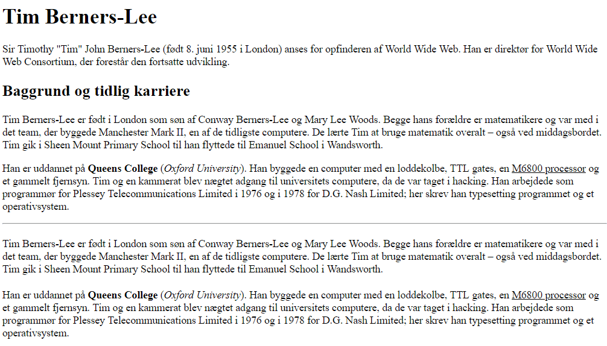

# HTML opgave

Her kan du arbejde med lidt tekst og formatering.

- Opret en tom side med en standard HTML skabelon 
  - Titlen skal være "Tim Berners-Lee"
  - Sørg for at den kan valideres inden du går videre!!
- Du skal nu oprette en side omhandlende Tim Berners-Lee
  - Start med en Overskrift (h1) med indholdet "Tim-Berners Lee"
  - Opret den første paragraf fra [WikiPedia](https://da.wikipedia.org/wiki/Tim_Berners-Lee)
  - Tilføj en mindre overskrift (h2) "Baggrund og tidlig karriere"
  - Tilføj de næste to paragrafer fra [WikiPedia](https://da.wikipedia.org/wiki/Tim_Berners-Lee)
  - I den sidste paragraf skal du sørge for, at "Queens College" skal være fed (b), Oxford University med kursiv (i) og "M6800 processor" skal understreges (u).
    - Husk at formatering i moderne html sider sker ved hjælp af css!
  - Tilføj en streg (hr - horisontal ruler)
  - Kopier de to sidste paragrafer, men i stedet for at bruge
    - p-opmærkning skal du bruge div-opmærkning med en class-attribut med værdien minP
    - b-opmærkning skal du bruge span-opmærkning med en class-attribut med værdien minFed
    - i-opmærkning skal du bruge span-opmærkning med en class-attribut med værdien minKursiv
    - u-opmærkning skal du bruge span-opmærkning med en class-attribut med værdien minUnderstreg
  - Tilføj nu følgende style-opmærkning nederst i head-opmærkningen
```css
<style>
  .minP {
    margin-top: 20px;
  }
  .minFed {
    font-weight: bold;
  }
  .minKursiv {
    font-style: italic;
  }
  .minUnderstreg {
    text-decoration: underline;
  }
</style>
```

Husk at siden skal kunne valideres! 


Det skal se nogenlunde sådan ud:




Se eventuelt løsning [her](index.html).

- Du kan eventuelt prøve at lege lidt med css-elementerne - prøv
  - color: red;
  - text-shadow: 5px 5px 5px red;
  - margin: 10px;
