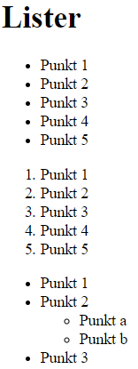

# HTML opgave i lister

Her kan du øve dig lidt i lister

- Skab en index.html med en standard skabelon (!+tab)
- Tilføj en h1 med teksten "Lister"
- Tilføj en uordnet liste (ul) med 5 elementer med teksten (Punkt 1, Punkt 2 mv)
- Tilføj en ordnet liste (ol) med 5 elementer med teksten (Punkt 1, Punkt 2 mv)
- Tilføj en uordnet liste (ul) med 3 elementer med teksten (Punkt 1, Punkt 2 mv), men Punkt 2 skal have en uordnet liste med to elementer (Punkt a, Punk5 b)

Det skal ende således:

HUSK - siden skal kunne valideres mod W3C. Brug Live-server til at se resultatet, og se eventuelt [min løsning](index.html).