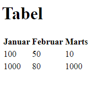

# HTML opgave i tabeller

Her kan du øve dig lidt i brugen af "table"

- Skab en index.html med en standard skabelon (!+tab)
- Tilføj en h1 med teksten "Tabel"
- Tilføj en tabel (table) med tre rækker (tr) og tre kolonner (th/td)
    - Den første række skal indeholde overskrifter (th) med måneder (januar, februar mv)
    - De næste to rækker skal indeholde værdier (td) [100, 50, 10] og [1000, 80, 1000]

Det skal ende således:

prøv eventuelt at lægge attributten align="right" på alle td'er - men typisk vil man jo styre design i CSS.

HUSK - siden skal kunne valideres mod W3C. Brug Live-server til at se resultatet, og se eventuelt [min løsning](index.html).