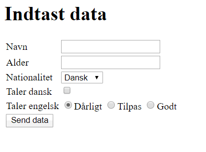
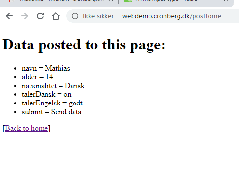

# HTML opgave i brug af form elementer

I denne opgave skal du skabe en HTML side hvor brugerne kan indtaste data som følger:

Data skal sendes til http://webdemo.cronberg.dk/posttome som en POST. Denne side modtager blot data og viser hvad der er modtaget:

HUSK - siden skal kunne valideres mod W3C. Brug Live-server til at se resultatet, og se eventuelt [min løsning](index.html).